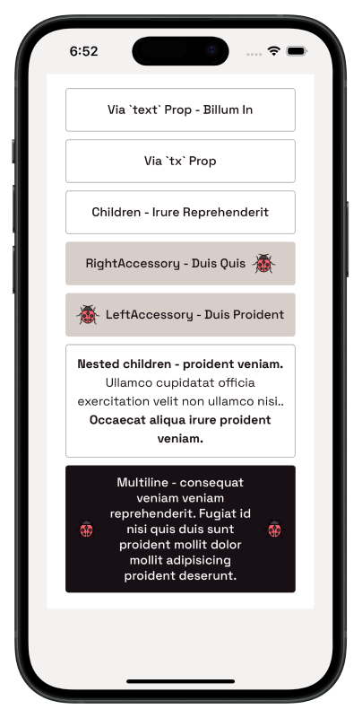

# Button

The `Button` component is a wrapper around the [`Pressable`](https://reactnative.dev/docs/pressable) component. Any prop that can be passed to `Pressable` can be passed to `Button` and it will be forwarded. `Button` renders a button with given text in a [`Text`](./Text.md) component or children. It allows you to specify the preset style of the button, you can override both the `Pressable` and `Text` styles.



# Usage

```tsx
<Button
  text="Click It"
  tx="button.clickIt"
  preset="default"
  onPress={() => Alert.alert("pressed")}
  style={[{ paddingVertical: 100 }, { borderRadius: 0 }]}
  pressedStyle={[{ backgroundColor: "red" }, { borderRadius: 0 }]}
  textStyle={[{ fontSize: 20 }, { color: "#a511dc" }]}
  pressedTextStyle={[{ fontSize: 20 }, { color: "#a51111" }]}
  RightAccessory={(props) => <Icon icon="check" />}
  LeftAccessory={(props) => <Icon icon="close" />}
/>
```

## Props

### `text`

The `text` prop is required if `tx` or `children` are not provided. This is the text to be rendered in the button.

```tsx
<Button text="Click me" />
```

### `tx`

The `tx` prop is required if `text` or `children` are not provided. This is the translation key to be used to translate the text.

```tsx
<Button tx="button.clickMe" />
```

### `children`

The `children` prop is required if no `tx` or `text` prop is passed. This is the content to be rendered in the button in place of the default `Text` component.

```tsx
<Button>
  <Text>Click me</Text>
</Button>
```

### `preset`

The `preset` prop is optional. This is the preset style of the button. It can be one of the following built-in options: `default`, `filled`, `reversed`

```tsx
<Button preset="default" tx="button.clickMe" />
```

To make a custom preset, add a key to the `$viewPresets`, `$textPresets`, `$pressedViewPresets` and `$pressedTextPresets` objects in `app/components/Button.tsx` and then pass the name of the preset to the `preset` prop.

```tsx
const $viewPresets = {
  // ...
  danger: [
    $baseViewStyle,
    { backgroundColor: colors.palette.angry500 },
  ] as StyleProp<ViewStyle>,
};

const $textPresets: Record<Presets, StyleProp<TextStyle>> = {
  // ...
  danger: [
    $baseTextStyle,
    { color: colors.palette.angry500 },
  ] as StyleProp<TextStyle>,
};

const $pressedViewPresets: Record<Presets, StyleProp<ViewStyle>> = {
  // ...
  danger: { backgroundColor: colors.palette.angry500 },
};

const $pressedTextPresets: Record<Presets, StyleProp<TextStyle>> = {
  angry: { opacity: 0.7 },
};
```

```tsx
<Button preset="danger" text="Delete" />
```

### `textStyle`

The `textStyle` prop is optional. This can be used to style text in the button. Values passed here will override anything set in the preset.

```tsx
<Button textStyle={{ fontSize: 20, color: "#a511dc" }} />
```

### `pressedTextStyle`

The `pressedTextStyle` prop is optional. This can be used to style text in the button when it is pressed. Values passed here will override anything set in the preset.

```tsx
<Button pressedTextStyle={{ fontSize: 20, color: "#a51111" }} />
```

### `disabledTextStyle`

The `disabledTextStyle` prop is optional. It can be used to style text in the button when the `disabled` prop is set. Values here will override anything set in the preset.

```tsx
<Button disabled disabledTextStyle={{ fontSize: 20, color: "#000000" }} />
```

### `style`

The `style` prop is optional. This can be used to style the `Pressable` component of the `Button`. Values passed here will override anything set in the preset.

```tsx
<Button style={{ paddingVertical: 20, borderRadius: 10 }}>
```

### `pressedStyle`

The `pressedStyle` prop is optional. This can be used to style the `Pressable` component of the `Button` when it is pressed. Values passed here will override anything set in the preset.

```tsx
<Button pressedStyle={{ backgroundColor: "red" }} />
```

### `disabledStyle`

The `disabledStyle` prop is optional. This can be used to style the `Pressable` component of the `Button` when the `disabled` prop is truthy. Values passed here will override anything set in the preset.

```tsx
<Button disabledStyle={{ opacity: 0.5 }} />
```

### `LeftAccessory` and `RightAccessory`

The `LeftAccessory` and `RightAccessory` props are optional. They can be used to render an accessory on the left or right side of the button. It can be a React component or a function that returns a React component. The accessory component will receive the pressed state of the `Pressable` via the `pressableState` prop, so you can make a custom accessory component render differently when pressed. Additionally, you can utilize the default accessory styles via the `style` prop.

```tsx
<Button
  LeftAccessory={(props) => (
    <Icon
      containerStyle={props.style}
      size={props.pressableState.pressed ? 50 : 40}
      icon="check"
    />
  )}
/>
```

```tsx
<Button
  RightAccessory={(props) => (
    <Icon
      containerStyle={props.style}
      size={props.pressableState.pressed ? 50 : 40}
      icon="check"
    />
  )}
/>
```

If the accessories flicker when some prop or state changes, you can memoize the accessory with `useMemo`.

```tsx
<Button
  LeftAccessory={useMemo(
    () =>
      function LeftIcon(props: ButtonAccessoryProps) {
        return <Icon icon={props.pressableState.pressed ? "view" : "hidden"} />;
      },
    []
  )}
/>
```

### `disabled`

The `disabled` prop is optional. It gets passed to the underlying `Pressable` component. When truthy, it will [disable the press behavior on the pressable](https://reactnative.dev/docs/pressable#disabled). It will also update the [`accessibilityState`](https://reactnative.dev/docs/0.72/touchablewithoutfeedback#accessibilitystate) of the `Pressable` when set.

This prop will be passed down to the `LeftAccessory` and `RightAccessory` components, if they exist, and will cause the `disabledStyle` and `disabledTextStyle` props to be used, if they have been set.
