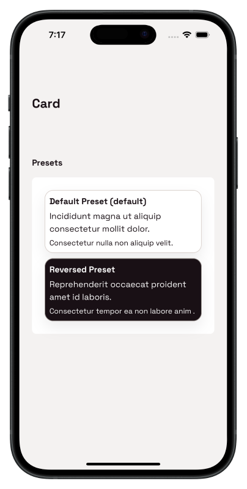
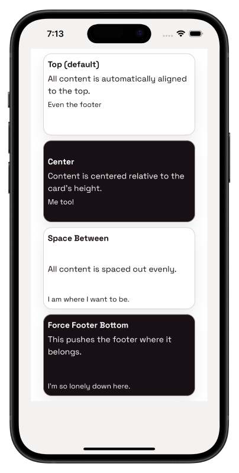

# Card

The `Card` component is intended to be used for vertically aligned related content. It is a container that can hold a heading, content, and footer. It can also hold a left and right component that will be aligned to the left and right of the card body.

## Props

```tsx
<Card
  preset="reversed"
  verticalAlignment="space-between"
  LeftComponent={<Text>Left</Text>}
  RightComponent={<Text>Right</Text>}
  heading="Card Heading"
  headingStyle={{ color: "#a511dc" }}
  HeadingTextProps={{ weight: "bold" }}
  content="Card Content"
  contentStyle={{ color: "#a511dc" }}
  ContentTextProps={{ weight: "light" }}
  footer="Card Footer"
  footerStyle={{ color: "#a511dc" }}
  FooterTextProps={{ weight: "medium" }}
/>
```

### `preset`

The `preset` prop is used to set the preset container style of the card. This affects the border and background color of the container. There are two preconfigured presets: `default` and `reversed`.



### Usage

```tsx
<Card
  preset="reversed"
  heading="Card Heading"
  content="Card Content"
  footer="Card Footer"
/>
```

### `verticalAlignment`

The `verticalAlignment` prop is used to set the vertical alignment of the card's content. This affects the alignment of the heading, content, and footer. There are four preconfigured alignments: `top`, `center`, `space-between`, and `force-footer-bottom`. `force-footer-bottom` behaves like `top`, but will force the footer to the bottom of the card.



### Usage

```tsx
<Card
  verticalAlignment="space-between"
  heading="Card Heading"
  content="Card Content"
  footer="Card Footer"
/>
```

### `LeftComponent` & `RightComponent`

The `LeftComponent` and `RightComponent` props are used to set the component that will be aligned to the left or right of the card body, respectively.


### Usage

```tsx
<Card
  LeftComponent={
    <AutoImage
      maxWidth={80}
      maxHeight={60}
      style={{ alignSelf: "center" }}
      source={{
        uri: "https://user-images.githubusercontent.com/1775841/184508739-f90d0ce5-7219-42fd-a91f-3382d016eae0.png",
      }}
    />
  }
  RightComponent={
    <Button
      preset="default"
      text="Click It"
      onPress={() => Alert.alert("pressed")}
    />
  }
  heading="Card Heading"
  content="Card Content"
  footer="Card Footer"
/>
```

### `heading`

The `heading` prop is used to set the heading text of the card.

```tsx
<Card heading="Card Heading" content="Card Content" footer="Card Footer" />
```

### `headingTx`

The `headingTx` prop is used to set the heading text of the card using a translation key.

```tsx
<Card headingTx="card.heading" content="Card Content" footer="Card Footer" />
```

### `headingTxOptions`

The `headingTxOptions` prop is used to set the options for the translation key used by the `headingTx` prop.

```tsx
<Card
  headingTx="card.heading"
  headingTxOptions={{ count: 2 }}
  content="Card Content"
  footer="Card Footer"
/>
```

### `headingStyle`

The `headingStyle` prop is used to set the style of the heading text.

```tsx
<Card
  heading="Card Heading"
  headingStyle={{ color: "red" }}
  content="Card Content"
  footer="Card Footer"
/>
```

### `HeadingTextProps`

The `HeadingTextProps` prop is used to pass any additional props to the heading `Text` component. It will accept any prop that the [`Text`](./Text.md) component accepts.

```tsx
<Card
  heading="Card Heading"
  HeadingTextProps={{ size: "lg" }}
  content="Card Content"
  footer="Card Footer"
/>
```

### `HeadingComponent`

The `HeadingComponent` prop is used to set the component that will be used for the heading. This can be used to set a custom heading component.

```tsx
<Card
  HeadingComponent={
    <Button preset="reversed" text="HeadingComponent" icon="ladybug" />
  }
  content="Card Content"
  footer="Card Footer"
/>
```

### `content`

The `content` prop is used to set the content text of the card.

```tsx
<Card heading="Card Heading" content="Card Content" footer="Card Footer" />
```

### `contentTx`

The `contentTx` prop is used to set the content text of the card using a translation key.

```tsx
<Card heading="Card Heading" contentTx="card.content" footer="Card Footer" />
```

### `contentTxOptions`

The `contentTxOptions` prop is used to set the options for the translation key used by the `contentTx` prop.

```tsx
<Card
  heading="Card Heading"
  contentTx="card.content"
  contentTxOptions={{ count: 2 }}
  footer="Card Footer"
/>
```

### `contentStyle`

The `contentStyle` prop is used to set the style of the content text.

```tsx
<Card
  heading="Card Heading"
  content="Card Content"
  contentStyle={{
    backgroundColor: colors.error,
    color: colors.palette.neutral100,
  }}
  footer="Card Footer"
/>
```

### `ContentTextProps`

The `ContentTextProps` prop is used to pass any additional props to the content `Text` component. It will accept any prop that the [`Text`](./Text.md) component accepts.

```tsx
<Card
  heading="Card Heading"
  content="Card Content"
  ContentTextProps={{ size: "lg" }}
  footer="Card Footer"
/>
```

### `ContentComponent`

The `ContentComponent` prop is used to set the component that will be used for the content. This can be used to set a custom content component.

```tsx
<Card
  heading="Card Heading"
  ContentComponent={
    <Button preset="reversed" text="ContentComponent" icon="ladybug" />
  }
  footer="Card Footer"
/>
```

### `footer`

The `footer` prop is used to set the footer text of the card.

```tsx
<Card heading="Card Heading" content="Card Content" footer="Card Footer" />
```

### `footerTx`

The `footerTx` prop is used to set the footer text of the card using a translation key.

```tsx
<Card heading="Card Heading" content="Card Content" footerTx="card.footer" />
```

### `footerTxOptions`

The `footerTxOptions` prop is used to set the options for the translation key used by the `footerTx` prop.

```tsx
<Card
  heading="Card Heading"
  content="Card Content"
  footerTx="card.footer"
  footerTxOptions={{ count: 2 }}
/>
```

### `footerStyle`

The `footerStyle` prop is used to set the style of the footer text.

```tsx
<Card
  heading="Card Heading"
  content="Card Content"
  footer="Card Footer"
  footerStyle={{ color: "red" }}
/>
```

### `FooterTextProps`

The `FooterTextProps` prop is used to pass any additional props to the footer `Text` component. It will accept any prop that the [`Text`](./Text.md) component accepts.

```tsx
<Card
  heading="Card Heading"
  content="Card Content"
  footer="Card Footer"
  FooterTextProps={{ size: "lg" }}
/>
```

### `FooterComponent`

The `FooterComponent` prop is used to set the component that will be used for the footer. This can be used to set a custom footer component.

```tsx
<Card
  heading="Card Heading"
  content="Card Content"
  FooterComponent={
    <Button preset="reversed" text="FooterComponent" icon="ladybug" />
  }
/>
```
