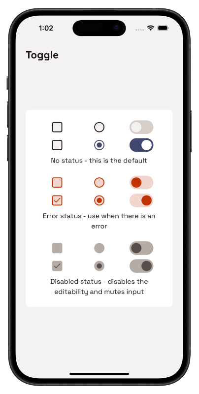

# Toggle

This component is a flexible component that can be used to toggle a boolean value. It can be used to render a switch, checkbox, or radio button, and exposes style props for every element.



## Props

### `variant`

The `variant` prop determines the type of toggle to render. It can be one of the following: `switch`, `checkbox`, or `radio`.

```tsx
<Toggle value={value} onValueChange={setValue} variant="checkbox" />
```

### `status`

The `status` prop is used to determine the interactability or style of the toggle. It can be set to `disabled` or `error`. It is `null` by default.

When set to `error`, elements of the toggle will have their colors set to `colors.errorBackground` or `colors.error`.

```tsx
<Toggle value={value} onValueChange={setValue} status="disabled" />
```

### `editable`

The `editable` prop determines whether the toggle is interactable. It is `true` by default. Setting the `status` prop to `disabled` also will set `editable` to `false`.

```tsx
<Toggle value={value} onValueChange={setValue} editable={false} />
```

### `value`

The `value` prop determines whether the toggle is on or off. It is `false` by default.

```tsx
<Toggle value={value} onValueChange={setValue} value={true} />
```

### `onValueChange`

The `onValueChange` prop is a callback that is called when the toggle is toggled. It is `undefined` by default. Since the toggle is controlled, you must set the `value` prop in this callback to update the toggle.

```tsx
<Toggle value={value} onValueChange={setValue} onValueChange={setValue} />
```

### `containerStyle`

The `containerStyle` prop is a style object that is applied to the container of the toggle.

```tsx
<Toggle
  value={value}
  onValueChange={setValue}
  containerStyle={{ backgroundColor: "#fff" }}
/>
```

### `inputOuterStyle`

The `inputOuterStyle` prop is a style object that is applied to the outer container of the toggle input. This gives the inputs their size, shape, "off" background-color, and outer border.

```tsx
<Toggle
  value={value}
  onValueChange={setValue}
  inputOuterStyle={{ backgroundColor: "#fff" }}
/>
```

### `inputInnerStyle`

The `inputInnerStyle` prop is a style object that is applied to the inner container of the toggle input. This gives the inputs their "on" background-color and inner border.

```tsx
<Toggle
  value={value}
  onValueChange={setValue}
  inputInnerStyle={{ backgroundColor: "#000" }}
/>
```

### `inputDetailStyle`

The `inputDetailStyle` prop is a style object that is applied to the detail container of the toggle input. For checkbox, this affects the Image component. For radio, this affects the dot View. For switch, this affects the knob View.

```tsx
<Toggle
  value={value}
  onValueChange={setValue}
  inputDetailStyle={{ backgroundColor: "#000" }}
/>
```

### `labelPosition`

The `labelPosition` prop determines the position of the label relative to the action component. It can be `left` or `right`. It is `right` by default.

```tsx
<Toggle value={value} onValueChange={setValue} labelPosition="left" />
```

### `label`

The `label` prop is a string that is used as the label for the toggle.

```tsx
<Toggle value={value} onValueChange={setValue} label="Remember Me" />
```

### `labelTx`

The `labelTx` prop is a key to a string in the `i18n` translation file. It is used as the label for the toggle.

```tsx
<Toggle
  value={value}
  onValueChange={setValue}
  labelTx="login.rememberUsername"
/>
```

### `labelTxOptions`

The `labelTxOptions` prop is an object that is passed to the `i18n` translation function. It is used to pass in values to the translation string.

```tsx
<Toggle
  value={value}
  onValueChange={setValue}
  labelTx="login.rememberUsername"
  labelTxOptions={{ username: "john" }}
/>
```

### `labelStyle`

The `labelStyle` prop is a `StyleProp<TextStyle>` object that is applied to the label.

```tsx
<Toggle value={value} onValueChange={setValue} labelStyle={{ color: "#000" }} />
```

### `LabelTextProps`

The `LabelTextProps` prop is a `TextProps` object (from the [`Text`](./Text.md)) component that is applied to the label.

```tsx
<Toggle
  value={value}
  onValueChange={setValue}
  LabelTextProps={{ size: "lg" }}
/>
```

### `helper`

The `helper` prop is a string that is used as the helper for the toggle.

```tsx
<Toggle value={value} onValueChange={setValue} helper="Remember Me" />
```

### `helperTx`

The `helperTx` prop is a key to a string in the `i18n` translation file. It is used as the helper for the toggle.

```tsx
<Toggle
  value={value}
  onValueChange={setValue}
  helperTx="login.rememberUsername"
/>
```

### `helperTxOptions`

The `helperTxOptions` prop is an object that is passed to the `i18n` translation function. It is used to pass in values to the translation string.

```tsx
<Toggle
  value={value}
  onValueChange={setValue}
  helperTx="login.rememberUsername"
  helperTxOptions={{ username: "john" }}
/>
```

### `HelperTextProps`

The `HelperTextProps` prop is a `TextProps` object (from the [`Text`](./Text.md)) component that is applied to the helper.

```tsx
<Toggle
  value={value}
  onValueChange={setValue}
  HelperTextProps={{ size: "lg" }}
/>
```

### `switchAccessibilityMode`

The `switchAccessibilityMode` is a special prop for the switch variant that adds a text/icon label for on/off states. Options are `text` and `icon`

```tsx
<Toggle
  value={value}
  onValueChange={setValue}
  variant="switch"
  switchAccessibilityMode="icon"
/>
```

### `checkboxIcon`

The `checkboxIcon` is a prop for the checkbox variant that allows you to customize the icon used for the "on" state.

```tsx
<Toggle variant="checkbox" checkboxIcon="ladybug" />
```
